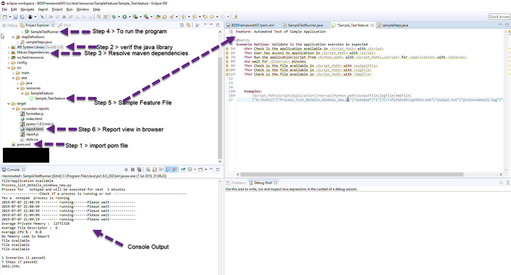
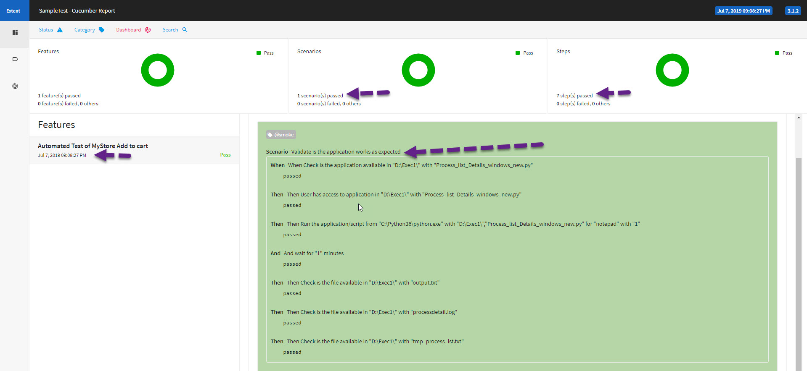

First I would like to apologize for misunderstanding .

**Project Title** : BDD Test Automation Suite  
**Project Description**  
   -  This is a test project that is designed with all basic required automation scripts to run a full BDD suite .
   -  It is a bridge between business language (User Stories) and automatic tests (JUnit, TestNG). 
   -  This project we have considered was the applicaiton that was created in Exec1
   -  Consider a Functional Test scenario , As a  tester I wanted to do below sanity checks 
        * Check Is the application available 
        * User has access to application 
        * Run the application/script 
        * Check is the files are available
	
* A basic simple test . And in this project the above scenario is automated and Report is also created automatically 
* Please note the Exec1 atleast 1time for all the test steps to be successful.
  
**More Details on Project**   
  * Framework used: BDD 
  * Language used: Cucumber, Junit , Java 
  * Type of Application Automated: Script/File Validation
  * Link of the application: From Exec1
     
**Getting Started**
1. The project is a maven project with Version  3.5.3
2. Clone or download the HTTPS of this project to your local drive.
3. Import the POM.xml file to Eclipse or Intellij and then resolve the POM dependencies.
4. Verify the Structure of project and match with below screen short,
   

**Prerequisites**
1. Please run the Exec1(Script Process_list_Details_windows_new.py) once from commandprompt
2. Please make sure you have Java 1.8 version  installed in your machine as per  (Step 2 from pic)
3. Make sure you have Eclipse or Intellij  installed
4. Verify all maven dependencies (Step 3 from pic)

**Initial Setup**
1. The project needs config.properties files to be edited.
	* Open the config.properties file from Path (/config/) 
	* Edit the driverPath=D:/selenium with Java/driver/chromedriver.exe (Set it to driver path from your machine)
		* You can download the driver for chrome from website https://sites.google.com/a/chromium.org/chromedriver/downloads
		* Note : Please verify your chrome browser version  before you download it .
		   	  My chrome Version is  75.0.3770.100 (Official Build) (64-bit) and download the driver accordingly
			  -Above step is not required but as part offramework without this step it will fail.
			  -You don't have to download as we are not using it just create and place a file with name chromedriver.exe
			  
**Running the tests**

1. Inside the folder src/test/java , You can find 3 packages  
	*CucumberTest
	*runner
	*StepDefinition
2. Expand the Runner Package and open file SampleTestRunner.java (Step 4 from pic)
3. For BDD Steps open the stepdefinition file and open Sample_Test.feature file (Step 5 from pic) relate these steps with project description
  ** We are using Examples keyword to pass our arguments , All the Steps are rerunnabe with different example sets  
  	|Script_Path|Script|Application|Interval|Python_path|outputfile|logfile|tmpfile|  
		|"D:\Exec1\"|"Process_list_Details_windows_new.py"|"notepad"|"1"|"C:\\Python36\\python.exe"|"output.txt"|"processdetail.log"|"tmp_process_lst.txt"|
		
* Script_Path  - Pass the folder path where your script is placed
* Script - Pass the Script name 
* Application - Process that you need to pass to script 
* Interval - time in mins that you need to pass to script 
* Python_path - Pass the path of your python.exe file (we need to run and test the script as part of our automation framework)
* outputfile - default it as "output.txt"
* logfile - default it as "processdetail.log"
* tmpfile - default it as "tmp_process_lst.txt"
	
4. Right click and run as Junit unit Test
5. After successful completion , press f5 or Refresh the project explorer screen
6. A folder called target should be created (Step 6 from pic)
7. Open the report.html in chrome and a report as below can be seen ,

	
	
***Explanation on test Automation Suite:***
 Can be explained seperately in a call or can share a document with details if required.	

 ** **Author** **
 Agnel Leon

