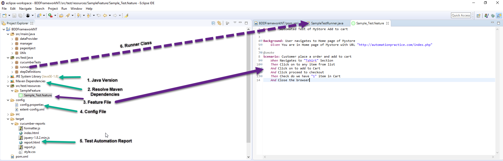
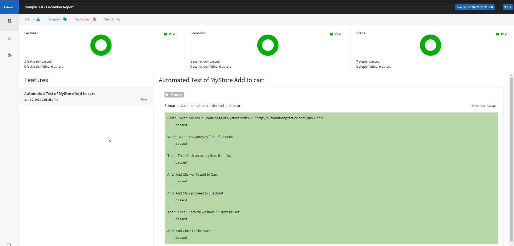

**Project Title** : BDD Test Automation Suite  
**Project Description**  
   -  This is a test project that is designed with all basic required automation scripts to run a full BDD suite .
   -  It is a bridge between business language (User Stories) and automatic tests (JUnit, TestNG). 
   -  This project we have considered a Web Application a Fashion Online Shop : http://automationpractice.com/index.php 
   -  Consider a Functional Test scenario , As a  tester I wants to navigate to this page , 
        * Go to a particular section 
        * And clicks on to any item 
        * And then click adds to cart 
        * And checks is the particular item added to cart and verify the number of item added to cart
* A basic simple test . And in this project the above scenario is automated and Report is also created automatically 
  
**More Details on Project**   
  * Framework used: BDD 
  * Language used: Cucumber, Junit , Java 
  * Type of Application Automated: Web Application
  * Link of the Web application: http://automationpractice.com/index.php
	   * Note : Considered a test web application from internet, doesn’t want to use any 3rd party web application because of Private rights.
     
**Getting Started**
1. The project is a maven project with Version  3.5.3
2. Clone or download the HTTPS of this project to your local drive.
3. Import the POM.xml file to Eclipse or Intellij and then resolve the POM dependencies.
4. Verify the Structure of project and match with below screen short,
   

**Prerequisites**
1. Please check do you have access to this test application Web Application a Fashion Online Shop : http://automationpractice.com/index.php .
2. Please make sure you have Java 1.8 version  installed in your machine as per  (Step 1 from pic)
3. Make sure you have Eclipse or Intellij  installed
4. Verify all maven dependencies 

**Initial Setup**
1. The project needs config.properties files to be edited.
	* Open the config.properties file from Path (/config/) -  (Step 4 from pic)
	* Edit the driverPath=D:/selenium with Java/driver/chromedriver.exe (Set it to driver path from your machine)
		* You can download the driver for chrome from website https://sites.google.com/a/chromium.org/chromedriver/downloads
		* Note : Please verify your chrome browser version  before you download it .
		   	  My chrome Version is  75.0.3770.100 (Official Build) (64-bit) and download the driver accordingly
			  
**Running the tests**

1. Inside the folder src/test/java , You can find 3 packages  
	*CucumberTest
	*runner
	*StepDefinition
2. Expand the Runner Package and open file SampleTestRunner.java (Step 6 from pic)
3. Right click and run as Junit unit Test
4. After successful completion , press f5 or Refresh the project explorer screen
5. A folder called target should be created (Step 5 from pic)
6. Open the report.html in chrome and a report as below can be seen ,

	
	
***Explanation on test Automation Suite:***
 Can be explained separated in a call or can share a document with details if required.	

 ** **Author** **
 Agnel Leon

